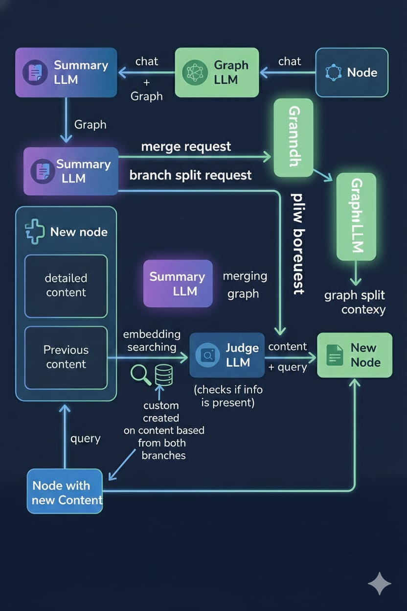
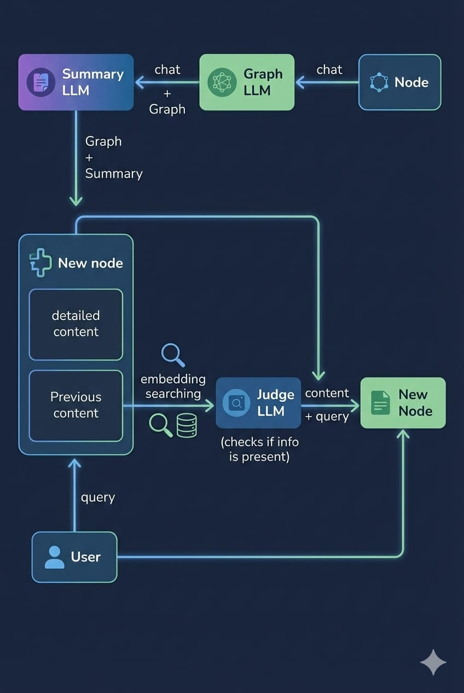
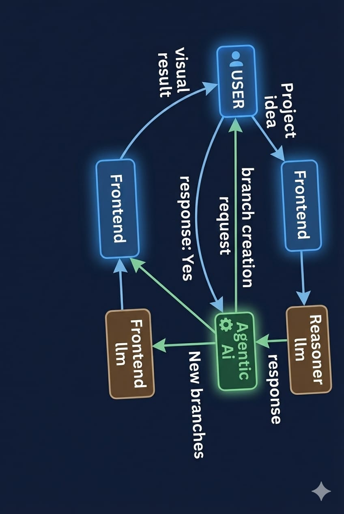
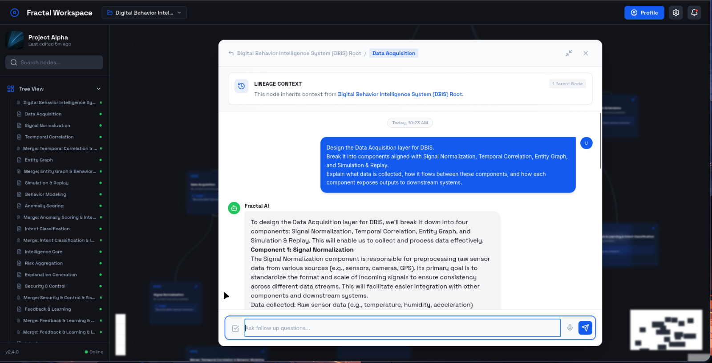
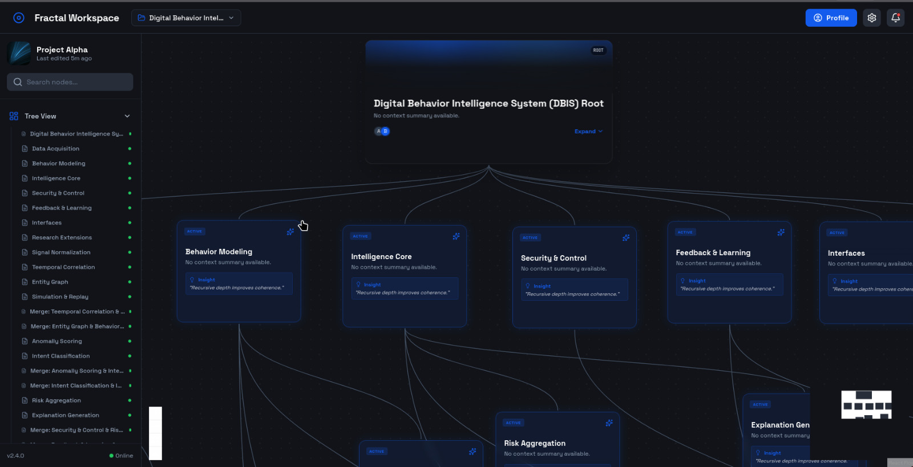
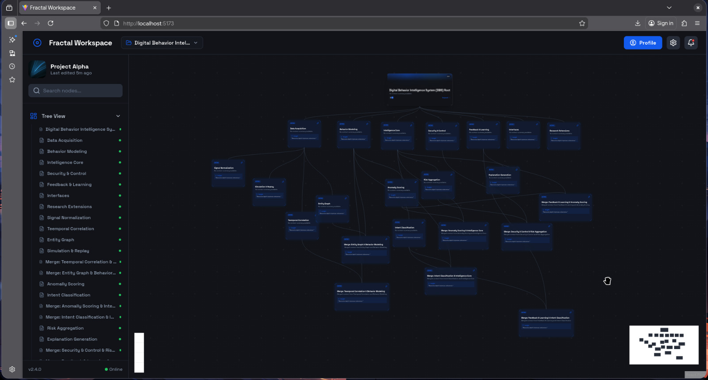

# 🧠 Fractal Workspace



> **The First Cognitive Operating System for Complex Thought**

Fractal Workspace represents a paradigm shift from linear "chatbots" to a **structured, event-sourced, multi-agent cognitive architecture**. It is designed to mirror how high-level reasoning actually works: branching, merging, summarizing, and evolving over time.

---

## 🌍 The Real World Problem

### 1. The "Linear Chat" Fallacy

Traditional AI interfaces (ChatGPT, Claude, etc.) force human thought into a single, linear stream.

- **Context Amnesia**: Long conversations lose the original context as the token window fills up.
- **Reliability Decay**: The "Lost in the Middle" phenomenon causes models to prioritize the beginning and end of a context window, ignoring crucial details buried in the middle.
- **Role Confusion**: A single model tries to be a creative writer, a strict coder, and a summarizer all at once, leading to degraded performance.
- **Ephemeral Insight**: Valuable deductions are lost in the scrollback. There is no persistent "memory" of decisions.

### 2. The "Context Pollution" Trap

When you ask an AI to change direction in a long chat, the old "bad" context still pollutes its reasoning. You can't just "fork" your thought process cleanly.

### 3. Lack of Structural Knowledge

Standard LLMs output text, not structure. They don't build a knowledge graph of your project as you work.

---

## 🚀 The Fractal Solution

We have built a system where **Events are Truth** and **State is Derived**.

### 🧬 Core Philosophy

1.  **Bounded Cognitive Universes**: Each "Node" on our infinite canvas is an isolated thought space with its own specific context, yet it inherits wisdom from its ancestors.
2.  **Multi-Agent Orchestration**: We don't use one LLM. We use a **swarm of specialized agents** which help the main llm to improve its efficiency.
3.  **Event Sourcing**: Every action (message, merge, split) is an immutable event. We can replay history, branch off at any point, and recompute reality.

---

## 🏗️ Technical Architecture

### The AI Agent Swarm

Instead of a monolithic model, we employ specialized agents:

| Agent                          | Model                     | Role                                                                                        |
| ------------------------------ | ------------------------- | ------------------------------------------------------------------------------------------- |
| **Main Reasoner**              | **llama3:8b**             | Handles deep, complex reasoning and coding tasks within a node.                             |
| **Lightweight Explorer**       | **Llama 3.2 (Local)**     | fast, zero-latency ideation for quick "what if" branches.                                   |
| **The Archivist (Summarizer)** | **llama3:8b**             | Compresses thousands of tokens of conversation into semantic "State" summaries.             |
| **Graph Builder**              | **llama3:8b (JSON Mode)** | Extracts structured entities and relationships (Knowledge Graph) from unstructured chat.    |
| **Merge Arbiter**              | **llama3:8b**             | Intelligently resolves conflicts when merging two divergent thought branches back together. |

### The Data Layer: Event Sourcing

We use **PostgreSQL** not just as a store, but as an event log.

- `node_events`: The Atomic Truth. (Create, Message, Merge, Graph_Update).
- `node_summaries`: Derived state, versioned and linked to events.
- `knowledge_graph`: A graph containing the information about the sequence of ideas or actions taken by the whole lineage of the current node.

### The Context Pipeline

Before any AI answers you, a dynamic context is assembled:
`Lineage Summary (Compressed)` + `Current Node Context` + `Relevant Knowledge Graph Nodes` + `Recent Messages`+ ' rag retrived context '.
*This ensures the AI is laser-focused on *exactly* where you are in the thought process, without pollution from irrelevant history.*

---

## 🛠️ Tech Stack

### Backend

- **Framework**: FastAPI (Python) - High performance, async.
- **Database**: PostgreSQL (with `asyncpg` & `SQLAlchemy`).
- **AI Inference**:
  - **Ollama**: For hosting local models (Llama 3.2,llama3:8b).
  - **External APIs**: OpenAI.
- **Validation**: Pydantic.

### Frontend

- **Core**: React 19 + TypeScript.
- **Build System**: Vite.
- **Canvas Engine**: React Flow (Customized for infinite branching).
- **State Management**: Zustand.
- **Styling**: TailwindCSS + Framer Motion (for "Glassmorphism" UI).

---

## 📸 Visual Deep Dive

|          Workspace Overview          |            Node Inspector            |
| :----------------------------------: | :----------------------------------: |
|  |  |

|     Conversational Interface     |          Branch Management           |
| :------------------------------: | :----------------------------------: |
|  |  |



> 📘 **For a complete breakdown, read the [Fractal Workspace](https://1drv.ms/w/c/92d94aa982402e61/IQCTWO1PBqhaQa6xnXL0s5YIAR_LOfayBCIhuMHKlrYnuAw?e=tmPhmQ).**

## ⚡ Getting Started

### Prerequisites

- **Python 3.10+**
- **Node.js 18+**
- **PostgreSQL 14+**
- **Ollama** (Running locally)

### 1. Installation

**Clone the repository:**

```bash
git clone https://github.com/your-repo/fractal-workspace.git
cd fractal-workspace
```

### 2. Ollama Setup

Start the Ollama server and create the required models:

```bash
# Start Ollama (if not already running)
ollama serve

# Create custom models
# Adjust paths if necessary based on your terminal location
ollama create main-reasoner -f backend/ollama/Modelfile.main-reasoner
ollama create graph-builder -f backend/ollama/Modelfile.graph-builder
```

### 3. Backend Setup

```bash
cd backend

# Create virtual environment
python -m venv venv
source venv/bin/activate  # or venv\Scripts\activate on Windows

# Install dependencies
pip install -r requirements.txt

# Configure Environment
cp .env.example .env
# Edit .env to add your API Keys (OPENAI_API_KEY, ANTHROPIC_API_KEY)
# and ensure DB credentials are correct.

# Setup Database
chmod +x setup_db.sh
./setup_db.sh
```

### 4. Frontend Setup

```bash
cd ../frontend

# Install dependencies
npm install

# Run development server
npm run dev
```

### 5. Run the Backend

```bash
cd ../backend
uvicorn main:app --reload
```

---

## 🔮 Future Roadmap

- [ ] **RAG Integration**: "Talk" to your entire codebase or PDF library.
- [ ] **Code Execution Sandbox**: Nodes that can run the code they write.
- [ ] **Collaborative Multiplayer**: Multiple users branching the same reality.

---

_Fractal Workspace: because linear thinking is obsolete._
